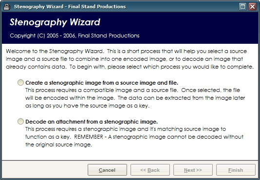



## Stenography Wizard

### Description

The Stenography Wizard makes hiding data in your images easier than ever. In three simple steps you'll be creating your own stenographic images and decoding them with ease. Simply select the source image and a file to hide in the picture to create a stenographic image. To decode an image, select the encoded image and the original source image and it'll seperate the hidden data stream and write it back to location on disk. Being a pure Visual Basic implementation it has several limitations - this software will only operate properly on a Windows XP operating system, and can only create BMP files. It will however load JPG and GIF files in many case for use as a source image. DO NOT UNDER ANY CIRCUMSTANCE Modify the encoded image - if the BMP palette becomes altered, or the color of any pixel is changed manually it will corrupt the encoded data stream. The data stream is also unrecoverable without the source image for comparison. The Wizard will automatically perform all of the necessary steps for selecting the most transparent encoding method.
 
### More Info
 

             |
---                |---
**Submitted On**   |2006-02-28 15:32:40
**By**             |[Coder\_Ghost](https://github.com/Planet-Source-Code/PSCIndex/blob/master/ByAuthor/coder-ghost.md)
**Level**          |Intermediate
**User Rating**    |4.7 (14 globes from 3 users)
**Compatibility**  |VB 6\.0
**Category**       |[Complete Applications](https://github.com/Planet-Source-Code/PSCIndex/blob/master/ByCategory/complete-applications__1-27.md)
**World**          |[Visual Basic](https://github.com/Planet-Source-Code/PSCIndex/blob/master/ByWorld/visual-basic.md)
**Archive File**   |[Stenograph1977082282006\.zip](https://github.com/Planet-Source-Code/coder-ghost-stenography-wizard__1-64491/archive/master.zip)

